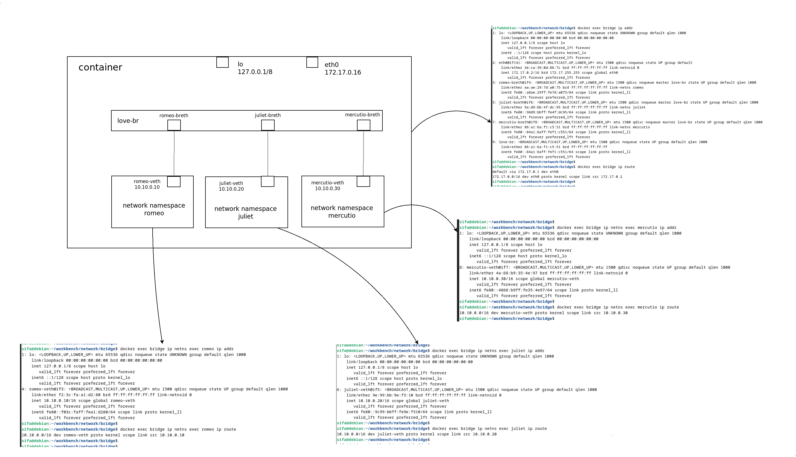
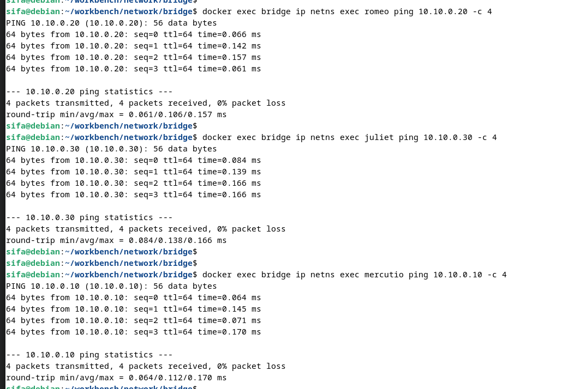
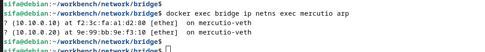

# Experiment on bridge between namespaces

Create three network namespaces ***romeo***, ***juliet*** & ***mercutio*** and connect them with bridge.  



For a sample routing table entry in romeo ***namespace***  

```
10.10.0.0/16 dev romeo-veth proto kernel scope link src 10.10.0.10
```

Packets to ip range ***10.10.0.0/16*** must be sent through the network interface ***romeo-veth*** with ***10.10.0.10*** as the source IP addres (address assigned to romeo-veth). ***proto kernel*** means that this entry is added by the kernel and ***scope link*** means that the destination IP addresses within 10.10.0.0/16 are valid only on the device ***romeo-veth***.

## Building
Build Docker image with

```
$ docker build -t bridge -f Dockerfile .
```

Run docker image with a name ***bridge***

```
$ docker run -d --name bridge --cap-add NET_ADMIN --cap-add CAP_SYS_ADMIN --security-opt apparmor=unconfined bridge
```

we need  
- NET_ADMIN
- CAP_SYS_ADMIN
- apparmor=unconfined namespace  

in order to create network namespace and perform network changes. These are a bit more restrictive than using ***--privileged*** run


## Experiment
Investigate the configuration  
  
```
$ docker exec bridge ip netns list
...
$ docker exec bridge ip addr
$ docker exec bridge ip route
...
$ docker exec bridge ip netns exec romeo ip addr
$ docker exec bridge ip netns exec romeo ir route
...
$ docker exec bridge ip netns exec juliet ip addr
$ docker exec bridge ip netns exec juliet ir route
...
$ docker exec bridge ip netns exec mercutio ip addr
$ docker exec bridge ip netns exec mercutio ip route
```

Do some connectivity checks through the bridge  
```
$ docker exec bridge ip netns exec romeo ping 10.10.0.20 -c 4
$ docker exec bridge ip netns exec juliet ping 10.10.0.30 -c 4
$ docker exec bridge ip netns exec mercutio ping 10.10.0.10 -c 4
```



Observe the arp table in one of the namespaces  
```
$ docker exec bridge ip netns exec mercutio arp
```



## Cleaning
```
$ docker kill bridge
§ docker container rm --force bridge
```

### License
MIT License - see [LICENSE](./../LICENSE) for full text.