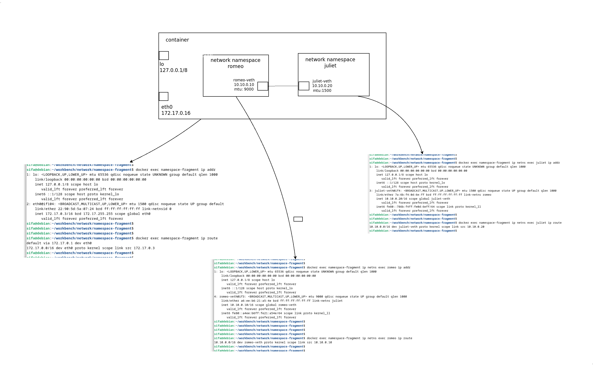
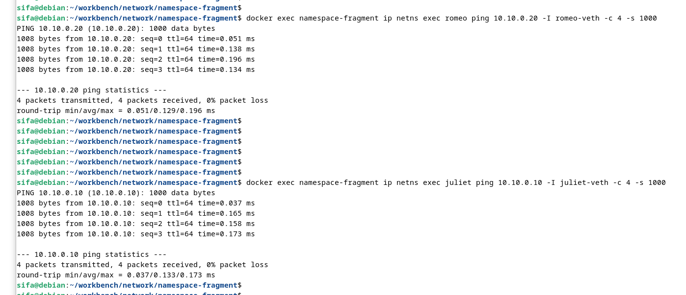
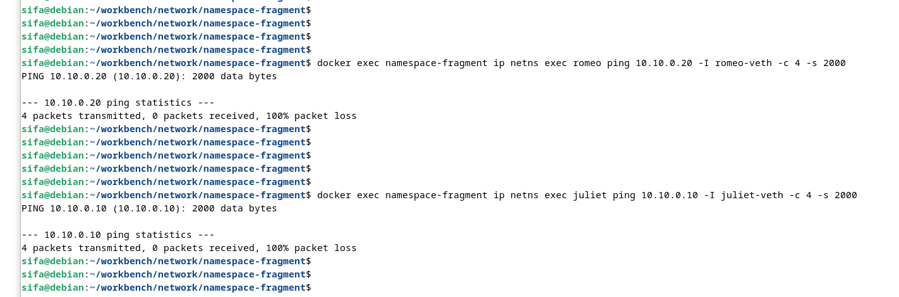
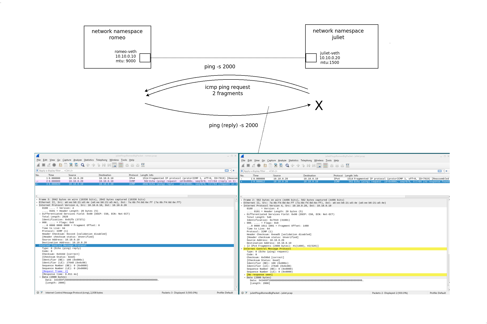
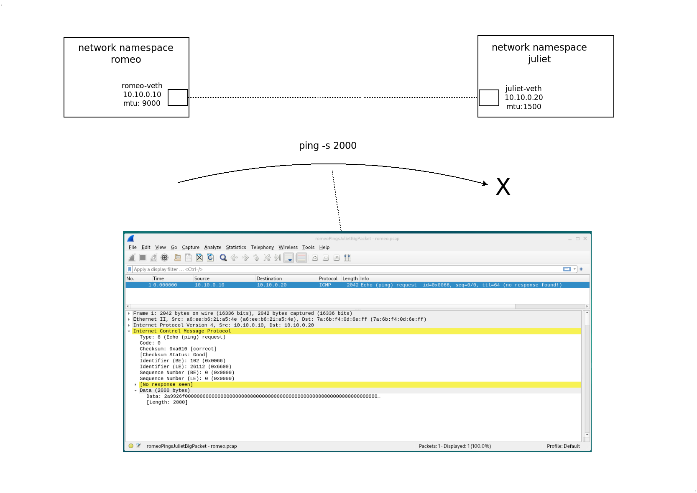

# Experiment on network namespace-fragments

Create two network namespaces ***romeo*** & ***juliet***, and connect them with veth pair  
  


For a sample routing table entry in romeo ***namespace-fragment***  

```
10.10.0.0/16 dev romeo-veth proto kernel scope link src 10.10.0.10
```

Packets to ip range ***10.10.0.0/16*** must be sent through the network interface ***romeo-veth*** with ***10.10.0.10*** as the source IP addres (address assigned to romeo-veth). ***proto kernel*** means that this entry is added by the kernel and ***scope link*** means that the destination IP addresses within 10.10.0.0/16 are valid only on the device ***romeo-veth***.

## Building
Build Docker image with

```
$ docker build -t namespace-fragment -f Dockerfile .
```

Run docker image with a name ***namespace-fragment***

```
$ docker run -d --name namespace-fragment --cap-add NET_ADMIN --cap-add CAP_SYS_ADMIN --security-opt apparmor=unconfined namespace-fragment
```

we need  
- NET_ADMIN
- CAP_SYS_ADMIN
- apparmor=unconfined namespace-fragment  

in order to create network namespace-fragment and perform network changes. These are a bit more restrictive than using ***--privileged*** run


## Experimenting
Get configurations  
```
$ docker exec namespace-fragment ip addr
$ docker exec namespace-fragment ip route
...
$ docker exec namespace-fragment ip netns exec romeo ip addr
$ docker exec namespace-fragment ip netns exec romeo ip route
...
$ docker exec namespace-fragment ip netns exec juliet ip addr
$ docker exec namespace-fragment ip netns exec juliet ip route

```

## Fragmentation Experiments
Start tcpdump in corresponding interfaces, do capture for rotating 300 seconds 1 iteration.

```
$ docker exec namespace-fragment ip netns exec romeo tcpdump -i romeo-veth -G 300 -W 1 -w romeo.pcap &
$ docker exec namespace-fragment ip netns exec juliet tcpdump -i juliet-veth -G 300 -W 1 -w juliet.pcap &
```

Pings that should succeed
```
$ docker exec namespace-fragment ip netns exec romeo ping 10.10.0.20 -I romeo-veth -c 4 -s 1000
$ docker exec namespace-fragment ip netns exec juliet ping 10.10.0.10 -I juliet-veth -c 4 -s 1000
```

Icmp packets that have small payload should succeed. Remember that romeo-veth mtu is 9000, juliet-veth mtu is 1500.  
  



Pings with bigger payload will fail (in this setup).
```
$ docker exec namespace-fragment ip netns exec romeo ping 10.10.0.20 -I romeo-veth -c 4 -s 2000
$ docker exec namespace-fragment ip netns exec juliet ping 10.10.0.10 -I juliet-veth -c 4 -s 2000

```
  



Sending big packets from ***juliet-veth*** will be fragmented wrt mtu value. We observe defragmentation in ***romeo-veth*** side. Replies are sended back as original size as romeo-veth's mtu is bigger.  
  


Arriving big packets to ***juliet-veth*** will be dropped due to lower mtu value. In real world rejecting side will reply with ICMP "Fragmentation Needed" (IPv4) or "Packet Too Big" (IPv6), which we dont observe in this setup. 
  


Copy pcaps back
```
$ docker cp namespace-fragment:juliet.pcap .
$ docker cp namespace-fragment:romeo.pcap .

```

## Cleaning
```
$ docker kill namespace-fragment
§ docker container rm --force namespace-fragment
```

### License
MIT License - see [LICENSE](./../LICENSE) for full text.