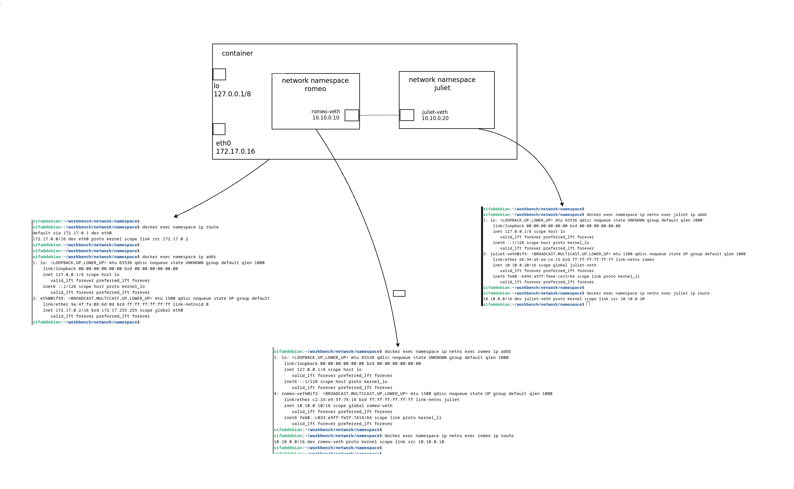

# Experiment on network namespaces

Create two network namespaces ***romeo*** & ***juliet***, and connect them with veth pair  



For a sample routing table entry in romeo ***namespace***  

```
10.10.0.0/16 dev romeo-veth proto kernel scope link src 10.10.0.10
```

Packets to ip range ***10.10.0.0/16*** must be sent through the network interface ***romeo-veth*** with ***10.10.0.10*** as the source IP addres (address assigned to romeo-veth). ***proto kernel*** means that this entry is added by the kernel and ***scope link*** means that the destination IP addresses within 10.10.0.0/16 are valid only on the device ***romeo-veth***.

## Building
Build Docker image with

```
$ docker build -t namespace -f Dockerfile .
```

Run docker image with a name ***namespace***

```
$ docker run -d --name namespace --cap-add NET_ADMIN --cap-add CAP_SYS_ADMIN --security-opt apparmor=unconfined namespace
```

we need  
- NET_ADMIN
- CAP_SYS_ADMIN
- apparmor=unconfined namespace  

in order to create network namespace and perform network changes. These are a bit more restrictive than using ***--privileged*** run


## Experimenting
Give a ping from romeo to juliet
```
$ docker exec namespace ip netns exec romeo ping 10.10.0.20 -c 4
$ docker exec namespace ip netns exec romeo ip route
$ docker exec namespace ip netns exec romeo ip addr
$ docker exec namespace ip netns exec romeo arp
...

```

## Cleaning
```
$ docker kill namespace
§ docker container rm --force namespace
```

### License
MIT License - see [LICENSE](./../LICENSE) for full text.