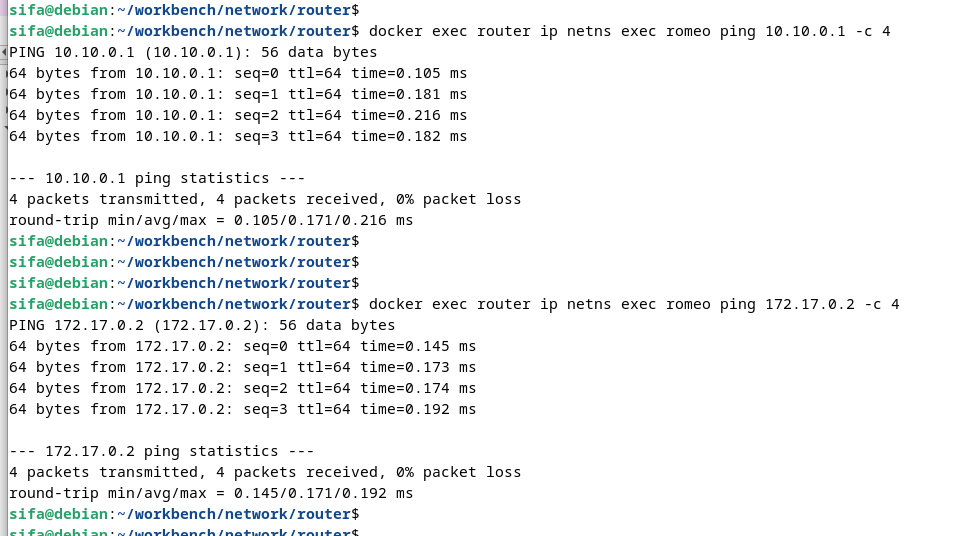

# Experiment on connecting namespaces with public breakout
Create three network namespaces ***romeo***, ***juliet*** & ***mercutio*** and connect them with public breakout  


For a sample routing table entry in romeo ***namespace***  

```
10.10.0.0/16 dev romeo-veth proto kernel scope link src 10.10.0.10
```


Packets to ip range ***10.10.0.0/16*** must be sent through the network interface ***romeo-veth*** with ***10.10.0.10*** as the source IP addres (address assigned to romeo-veth). ***proto kernel*** means that this entry is added by the kernel and ***scope link*** means that the destination IP addresses within 10.10.0.0/16 are valid only on the device ***romeo-veth***.

## Building
Build Docker image with

```
$ docker build -t router -f Dockerfile .
```

Run docker image with a name ***router***

```
$ docker run -d --name router --privileged router
```

In order to enable ip forwarding we need to use ***--privileged*** mode. Otherwise
we get ***sysctl: error setting key 'net.ipv4.ip_forward': Read-only file system*** error


## Experiment
Investigate the configuration  
  
```
$ docker exec router ip netns list
...
$ docker exec router ip addr
$ docker exec router ip route
...
$ docker exec router ip netns exec romeo ip addr
docker exec router ip netns exec romeo ip route
```

Do some connectivity checks through the host  
```
$ docker exec router ip netns exec romeo ping 10.10.0.20 -c 4
```

Do some connectivity checks towards default namespace  
```
$ docker exec router ip netns exec romeo ping 10.10.0.1 -c 4
$ docker exec router ip netns exec romeo ping 172.17.0.2 -c 4
```




## Experiment about upstream connectivity

(Optionally) take pcap captures to observe ***ip forwarding*** and ***snat/masquarade***
```
$ docker exec router tcpdump -i love-br -G 300 -W 1 -w love-br.pcap &
$ docker exec router tcpdump -i eth0 -G 300 -W 1 -w guest.pcap &
$ tcpdump -i wlp5s0 -G 300 -W 1 -w host.pcap &

```

Do some connectivity checks towards upstream/host (that ip addr will be the from the host running docker container)  
```
$ docker exec router ip netns exec romeo ping 192.168.178.54 -c 4
$ docker exec router ip netns exec romeo ping 8.8.8.8 -c 4
```


Get pcaps from guest  
```
$ docker cp router:love-br.pcap .
$ docker cp router:guest.pcap .

```

From bridge and host interface captures, we can see that source address "10-10-0-10" is rewritten as "172.17.0.2" to wards upstream.  


## Cleaning
```
$ docker kill router
§ docker container rm --force router
```

### License
MIT License - see [LICENSE](./../LICENSE) for full text.