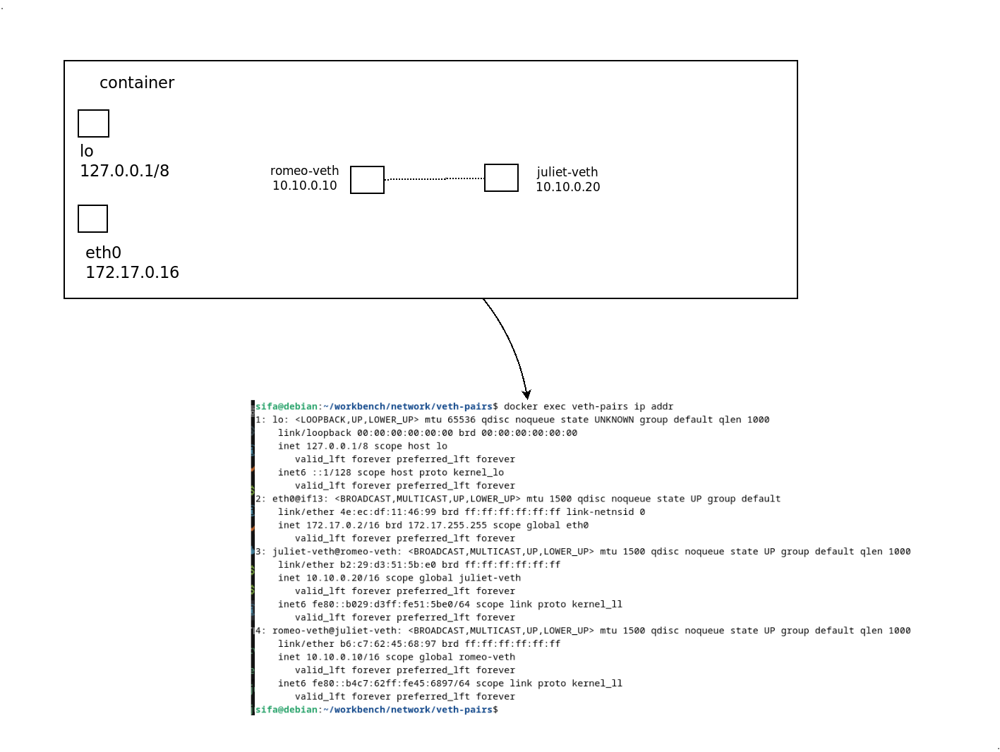
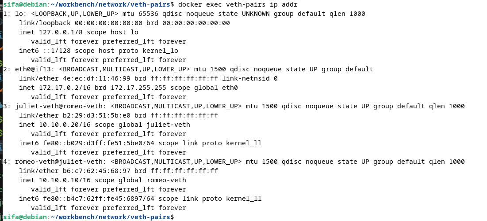
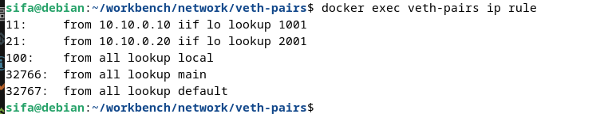
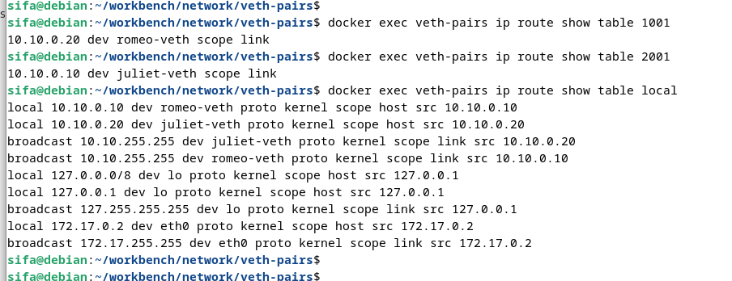
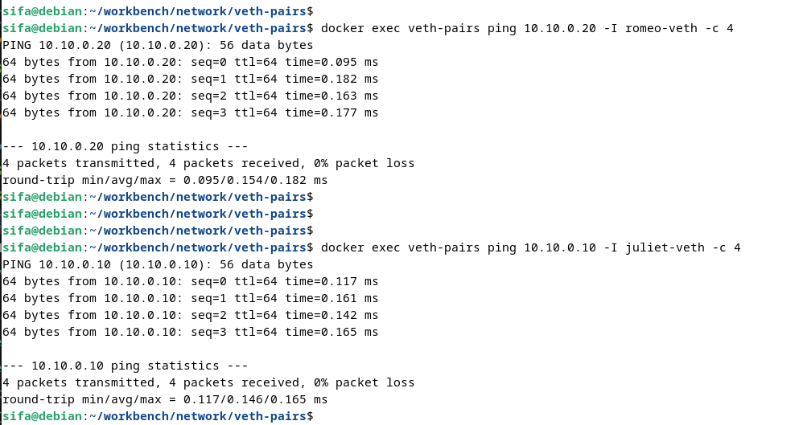
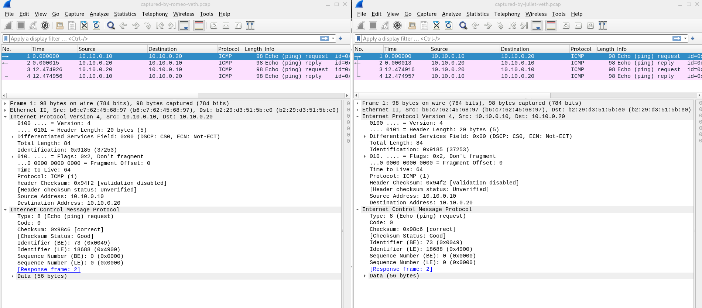

# Experiment on local veth pair

Create veth pair ***romeo-veth*** & ***juliet-veth***, and check connection.
As we are not using network namespace / seperate stack, we need some modification around routing to make this work. We have to enable host accepting its own packets and have routing rules higher priorith than local.




## Building
Build Docker image with

```
$ docker build -t veth-pairs -f Dockerfile .
```

Run docker image with a name ***veth-pairs***

```
$ docker run -d --name veth-pairs --privileged veth-pairs
```

we need to use ***--privileged*** flag to enable guest receiving its own packets through


## Experimenting
Give a ping from romeo to juliet
```
$ docker exec veth-pairs ip addr
```



Check custom routing  
```
$ docker exec veth-pairs ip rule
...
docker exec veth-pairs ip route show table 1001
docker exec veth-pairs ip route show table 2001
docker exec veth-pairs ip route show table local
```




## Observe connection
Start tcpdump in corresponding interfaces, do capture for rotating 300 seconds 1 iteration.

```
$ docker exec veth-pairs tcpdump -i romeo-veth -G 300 -W 1 -w romeo.pcap &
$ docker exec veth-pairs tcpdump -i juliet-veth -G 300 -W 1 -w juliet.pcap &
```

Pings that should succeed
```
$ docker exec veth-pairs ping 10.10.0.20 -I romeo-veth -c 4
$ docker exec veth-pairs ping 10.10.0.10 -I juliet-veth -c 4
```



Copy pcaps back
```
$ docker cp veth-pairs:juliet.pcap .
$ docker cp veth-pairs:romeo.pcap .

```

We should see successful icmp traffic between veth-pair.  



## Cleaning
```
$ docker kill veth
§ docker container rm --force veth
```


### License
MIT License - see [LICENSE](LICENSE) for full text.